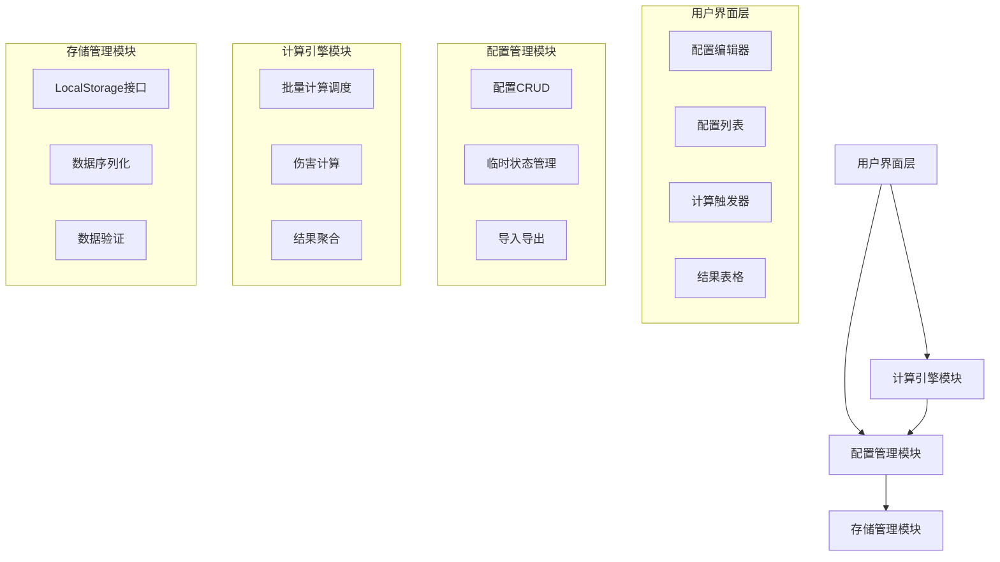

# 设计文档

## 概述

批量伤害计算功能将为宝可梦伤害计算器添加一个配置管理系统和批量计算引擎。用户可以创建、管理和持久化包含最多44个宝可梦配置的集合，并一次性计算选中配置与所有集合中配置的伤害数据。

该功能将扩展现有的 honkalculate.html 页面，添加配置管理界面和增强的计算结果展示。

## 架构

### 系统架构图



### 数据流

1. 用户通过UI创建/编辑配置 → 配置管理模块 → 存储管理模块
2. 用户触发批量计算 → 计算引擎模块 → 配置管理模块（获取配置）→ 计算引擎模块（执行计算）→ UI（展示结果）
3. 用户导出配置 → 配置管理模块 → 生成JSON文件
4. 用户导入配置 → 配置管理模块 → 数据验证 → 存储管理模块

## 组件和接口

### 1. 配置管理模块 (ConfigurationManager)

负责管理宝可梦配置集合的CRUD操作、临时状态和导入导出。

```javascript
class ConfigurationManager {
    constructor(storageManager) {
        this.storageManager = storageManager;
        this.currentSet = null;
        this.temporaryModifications = new Map(); // 存储临时修改
    }
    
    // 配置集合管理
    createConfigurationSet(name) { }
    loadConfigurationSet(name) { }
    saveConfigurationSet() { }
    deleteConfigurationSet(name) { }
    listConfigurationSets() { }
    
    // 配置项管理
    addConfiguration(config) { }
    removeConfiguration(index) { }
    updateConfiguration(index, config) { }
    getConfiguration(index) { }
    getAllConfigurations() { }
    
    // 临时修改管理
    setTemporaryModification(index, config) { }
    getEffectiveConfiguration(index) { }
    clearTemporaryModifications() { }
    commitTemporaryModifications() { }
    
    // 导入导出
    exportToJSON() { }
    importFromJSON(jsonData) { }
    
    // 验证
    validateConfiguration(config) { }
    validateConfigurationSet(set) { }
}
```

#### 配置数据结构

```javascript
// 配置集合
const ConfigurationSet = {
    name: String,           // 集合名称
    version: String,        // 数据格式版本
    generation: Number,     // 世代
    createdAt: Date,        // 创建时间
    updatedAt: Date,        // 更新时间
    configurations: Array   // 配置数组（最多44个）
};

// 单个宝可梦配置
const PokemonConfiguration = {
    id: String,             // 唯一标识符
    name: String,           // 宝可梦名称
    species: String,        // 种族
    forme: String,          // 形态
    level: Number,          // 等级
    gender: String,         // 性别
    
    // 种族值
    baseStats: {
        hp: Number,
        atk: Number,
        def: Number,
        spa: Number,
        spd: Number,
        spe: Number
    },
    
    // 个体值
    ivs: {
        hp: Number,
        atk: Number,
        def: Number,
        spa: Number,
        spd: Number,
        spe: Number
    },
    
    // 努力值
    evs: {
        hp: Number,
        atk: Number,
        def: Number,
        spa: Number,
        spd: Number,
        spe: Number
    },
    
    // 能力值提升
    boosts: {
        atk: Number,
        def: Number,
        spa: Number,
        spd: Number,
        spe: Number
    },
    
    nature: String,         // 性格
    ability: String,        // 特性
    item: String,           // 道具
    status: String,         // 状态
    teraType: String,       // 太晶属性（第九世代）
    teraActive: Boolean,    // 是否太晶化
    
    // 招式
    moves: [
        {
            name: String,
            type: String,
            category: String,
            basePower: Number,
            isCrit: Boolean,
            isZ: Boolean,
            isStellar: Boolean
        }
    ],
    
    // 元数据
    tier: String,           // 分级
    tags: Array             // 标签
};
```

### 2. 存储管理模块 (StorageManager)

负责与浏览器LocalStorage交互，处理数据序列化和反序列化。

```javascript
class StorageManager {
    constructor() {
        this.storageKey = 'pokemon_calc_config_sets';
        this.currentSetKey = 'pokemon_calc_current_set';
    }
    
    // 配置集合存储
    saveConfigurationSet(name, data) { }
    loadConfigurationSet(name) { }
    deleteConfigurationSet(name) { }
    listConfigurationSets() { }
    
    // 当前集合管理
    setCurrentSet(name) { }
    getCurrentSet() { }
    
    // 数据序列化
    serialize(data) { }
    deserialize(jsonString) { }
    
    // 存储空间管理
    getStorageUsage() { }
    clearStorage() { }
}
```

### 3. 批量计算引擎 (BatchCalculationEngine)

负责执行批量伤害计算，管理计算队列和结果聚合。

```javascript
class BatchCalculationEngine {
    constructor(configManager) {
        this.configManager = configManager;
        this.calculationQueue = [];
        this.results = [];
        this.isCalculating = false;
    }
    
    // 批量计算
    calculateBatch(attackerConfig, mode) { }
    
    // 单个计算
    calculateSingle(attacker, defender, field) { }
    
    // 结果处理
    aggregateResults() { }
    getBestMove(results) { }
    
    // 进度管理
    getProgress() { }
    cancelCalculation() { }
    
    // 事件回调
    onProgress(callback) { }
    onComplete(callback) { }
    onError(callback) { }
}
```

### 4. UI组件

#### 4.1 配置管理面板 (ConfigurationPanel)

```javascript
class ConfigurationPanel {
    constructor(configManager) {
        this.configManager = configManager;
        this.selectedIndex = -1;
    }
    
    // 渲染
    render() { }
    renderConfigurationList() { }
    renderConfigurationEditor() { }
    
    // 事件处理
    onAddConfiguration() { }
    onEditConfiguration(index) { }
    onDeleteConfiguration(index) { }
    onSaveConfiguration() { }
    onCancelEdit() { }
    
    // 导入导出
    onExport() { }
    onImport(file) { }
}
```

#### 4.2 结果表格组件 (ResultsTable)

扩展现有的DataTable，添加更多列和功能。

```javascript
class ResultsTable {
    constructor(tableElement) {
        this.table = tableElement;
        this.dataTable = null;
    }
    
    // 初始化
    initialize() { }
    
    // 数据管理
    setData(results) { }
    clearData() { }
    
    // 导出
    exportToCSV() { }
    
    // 列配置
    getColumnDefinitions() { }
}
```

## 数据模型

### LocalStorage数据结构

```javascript
// 存储键: 'pokemon_calc_config_sets'
{
    "sets": {
        "My Team 1": {
            name: "My Team 1",
            version: "1.0",
            generation: 9,
            createdAt: "2025-10-25T10:00:00Z",
            updatedAt: "2025-10-25T12:00:00Z",
            configurations: [
                // PokemonConfiguration对象数组
            ]
        },
        "VGC 2024": {
            // 另一个配置集合
        }
    }
}

// 存储键: 'pokemon_calc_current_set'
{
    "currentSetName": "My Team 1"
}
```

### 导入导出JSON格式

```json
{
    "format": "pokemon-damage-calc-config-set",
    "version": "1.0",
    "exportedAt": "2025-10-25T12:00:00Z",
    "data": {
        "name": "My Team 1",
        "generation": 9,
        "configurations": [
            {
                "id": "uuid-1",
                "name": "Venusaur",
                "species": "Venusaur",
                "level": 100,
                "nature": "Modest",
                "ability": "Chlorophyll",
                "item": "Life Orb",
                "evs": {
                    "hp": 0,
                    "atk": 0,
                    "def": 4,
                    "spa": 252,
                    "spd": 0,
                    "spe": 252
                },
                "moves": [
                    {
                        "name": "Growth",
                        "type": "Normal",
                        "category": "Status",
                        "basePower": 0
                    },
                    {
                        "name": "Giga Drain",
                        "type": "Grass",
                        "category": "Special",
                        "basePower": 75
                    }
                ]
            }
        ]
    }
}
```

## 错误处理

### 错误类型

1. **配置验证错误**
   - 无效的种族值、个体值、努力值
   - 不存在的宝可梦、招式、道具、特性
   - 配置数量超过44个限制

2. **存储错误**
   - LocalStorage空间不足
   - 数据损坏或格式错误
   - 权限问题

3. **计算错误**
   - 无效的配置数据
   - 计算过程中的异常

4. **导入导出错误**
   - 文件格式错误
   - 版本不兼容
   - 数据完整性问题

### 错误处理策略

```javascript
class ErrorHandler {
    static handle(error, context) {
        // 记录错误
        console.error(`Error in ${context}:`, error);
        
        // 显示用户友好的错误消息
        this.showUserMessage(error);
        
        // 根据错误类型采取恢复措施
        this.attemptRecovery(error, context);
    }
    
    static showUserMessage(error) {
        // 使用Bootstrap的alert或modal显示错误
    }
    
    static attemptRecovery(error, context) {
        // 尝试恢复操作
    }
}
```

## 测试策略

### 单元测试

1. **ConfigurationManager测试**
   - 配置CRUD操作
   - 临时修改管理
   - 数据验证
   - 导入导出

2. **StorageManager测试**
   - 数据序列化/反序列化
   - LocalStorage操作
   - 错误处理

3. **BatchCalculationEngine测试**
   - 批量计算逻辑
   - 结果聚合
   - 进度跟踪

### 集成测试

1. **端到端工作流测试**
   - 创建配置集合 → 添加配置 → 保存 → 执行计算 → 查看结果
   - 导出配置 → 导入配置 → 验证数据完整性
   - 临时修改 → 计算 → 保存/丢弃

2. **性能测试**
   - 44个配置的批量计算性能
   - LocalStorage读写性能
   - UI响应性

### 用户验收测试

1. 用户能够创建和管理配置集合
2. 用户能够执行批量计算并查看结果
3. 用户能够导入导出配置
4. 临时修改功能按预期工作
5. 错误消息清晰易懂

## 性能考虑

### 优化策略

1. **计算优化**
   - 使用Web Worker进行后台计算（可选）
   - 批量计算时使用requestAnimationFrame避免阻塞UI
   - 缓存重复计算结果

2. **存储优化**
   - 压缩JSON数据减少存储空间
   - 延迟保存（debounce）避免频繁写入
   - 定期清理过期数据

3. **UI优化**
   - 虚拟滚动处理大量配置列表
   - 懒加载配置详情
   - 使用CSS动画而非JavaScript动画

### 性能目标

- 44个配置的批量计算：< 5秒
- 配置保存操作：< 100ms
- 配置列表渲染：< 200ms
- 导入导出操作：< 1秒

## 安全考虑

1. **输入验证**
   - 所有用户输入必须经过验证
   - 防止XSS攻击（转义HTML）
   - 限制配置数量和大小

2. **数据完整性**
   - 导入时验证JSON格式和数据结构
   - 检查数据版本兼容性
   - 防止数据损坏

3. **隐私保护**
   - 所有数据存储在本地
   - 不向服务器发送用户配置
   - 导出文件不包含敏感信息

## 兼容性

### 浏览器支持

- Chrome 90+
- Firefox 88+
- Safari 14+
- Edge 90+

### 功能降级

- 如果LocalStorage不可用，使用内存存储（会话级别）
- 如果Web Worker不可用，使用主线程计算
- 如果File API不可用，禁用导入导出功能

## 未来扩展

1. **云同步**
   - 可选的云端存储
   - 跨设备同步配置

2. **配置模板**
   - 预设的常用配置模板
   - 社区分享的配置

3. **高级分析**
   - 配置对比分析
   - 弱点分析
   - 团队构建建议

4. **批量编辑**
   - 同时修改多个配置
   - 批量应用性格、道具等

5. **历史记录**
   - 配置修改历史
   - 计算历史记录
   - 撤销/重做功能
